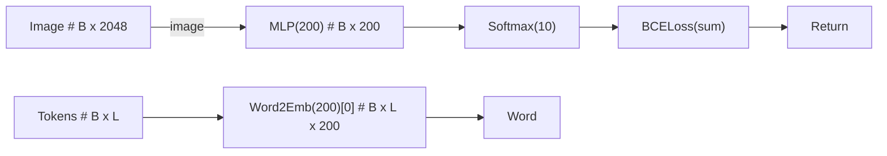

##### 软件体系结构：

准备照片，软件体系结构所有作者，都穿衬衫/西装，拍个证件照。还有一个作者简介，然后做成封面。【马老师找带头发的照片。】

##### 周四会议：

​		各位老师，各位学员好。今天在这里分享一下我在清华的学习体会。我是熊昆，1998出生于江西宜春所属的一个小城市--樟树市。从小学到中学，我成绩都是中上水平，高中考入了本市重点高中-樟树中学。我有一个亲哥哥，在我读高中的时候刚好考上华中科技大学。我的成长和我哥哥的帮助分不开。每次我哥回家都会给我讲一些大学教育才会有的知识。也是在这个时候，我了解了计算机不仅可以用来打游戏和查资料，还可以用来编程。在高二的时候，我哥哥给我带来了一本谭浩强的C语言教材，然后我就在家里的电脑上自学起了编程。虽然高三高考有点失误，但我还是考入了大连理工大学软件工程专业，与大多数同学不一样，在上大学的第一天，我就知道我的目标，我热爱计算机技术，我热爱软件。大学期间我几乎所有的计算机相关的学科都是95分以上，在大一大家还在入门学习C语言的时候，我担任组长，带领3个同学花了3天做了一个游戏，并获得学校比赛1等奖。然后大二大家开始学习Java的时候，我自学完了几乎所有的专业课，并且不满足于应用，我开始了解程序背后数学和算法。为了提高自己的算法能力，我加入了ACM组，参加了ACM竞赛，得到了全国比赛二等奖。在学习ACM算法的过程中，我在阅读论文，学习他人的博客，和刷题的过程中更加了解了数学作为中间语言的魅力，所以我开始重视数学，在大三的时候将所有的大学数学课都重新自学了一遍。大三下学期，在大家开始选择到底是找工作还是继续读研究生时，我先拿到了腾讯的Offer，然后发现自己因为大一没注意，挂科一门军事理论课没法保研，就决定尝试一下考研。就像乔布斯说的，人生都是一个个的点，只有当你往回看的时候，你才能将它们串成线。正是因为我大三自学过数学，并且专业课很好。我只花了3个月准备考研并以学硕第一考上了清华大学。

​		可是生活会逼迫你不断的进步，每个时期都需要不同的技能。进入研究生生活之后我感受到一些不适应。因为研究生需要的技能和本科生不太一样。研究生之前的学习包括ACM竞赛大部分都是应用型，也就是应用掌握的理论知识，来解决遇到的问题。但是研究生之后所需的技能是创新型。换句话说，也就是如何在已有的成果上转换视角，挖掘出改进点。在有幸进入了覃征老师的课题组之后，我一开始挺迷茫，不知道要以什么视角切入研究，也不知道怎么研究。尤其对于深度学习领域。记得我研一问过陈旭学长为什么论文中使用这样一个函数。然后得到的答案居然是，实验发现效果很好。这样的答案显然是我不太能接受的。虽然在初期看论文，理解论文，然后复现论文的路上碰到了很多困难，但是所幸覃老师的实验室有覃老师和很多乐于助人的学长和学姐们，他们愿意给我分享自己的成功经验。在我前进的路上，有覃老师教导我们科研的视觉和方法；组内的叶文文学长和陈旭学长带我入门了统计学习领域。在他们的帮助下和自己的努力下，我也算是初步具备一定的创新思维，比较独立的发表了一篇一作文章。创新是一个大课题，需要时间和汗水的沉淀，在这条路上，我从ACM比赛时候的推崇理论到现在觉得实践和理论一样重要，我觉得也是创新所必须的思维转变吧。

​		目前我找到了一份比较满意的工作，现在正在准备毕业论文。清华的3年研究生生活带给了我一个很棒的导师，很多优秀的朋友，一本软件体系结构第五版著作，还有一些创新的方法和体验。我觉得还是很值得的。

​		我给大家分享的就是，要以终生学习的态度来体验人生，每个阶段的难，都是在逼迫你掌握新技能，让你升级。

​		最后很感谢大家的倾听。

***周四晚上  7:10 分进入教室 317。***

###### -> 语速慢点。！！

###### -> 问小石怎么做的。

###### -> 最难的事情 / 最快乐的事情。

###### -> 节点的真实性。

###### -> 比赛如何转->科研；锻炼讲演能力。 8min-10min

我给家里喜报环节提一下。思想建设。音乐教室。为什么留不住人？？这个是关心的问题。不要抬高一个学校，贬低一个学校。

###### 工作：好好完成论文

## 素材

#### Mermaid + PyTorch[快速原型开发]

1. 使用python语言可以自定义PytorchModule模块，并且遵守Pytorch.Module的接口。
2. ${param(\<TXT\>)}表示\<TXT\>作为MODEL的参数，会放置到config.py中。
3. 模型构建

