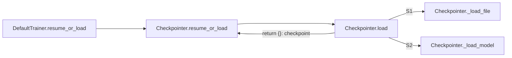

#### Abstract：

本文章主要讲的是 xkcv 库中，checkpoint 和 恢复的逻辑。这里进行记录。

1. 如果 cvpack2_train --resume / cvpack2_test 那么会进入resume 模式。Resume模式下，会从log下的last_checkpoint下的model_XXXX中进行读取。类似于将WEIGHTS设置为了last_checkpoint文件指向的那个文件。
2. 如果设置了MODEL.WEIGHTS，那么默认会从这个检查点进行恢复。会将对应的名字进行匹配。恢复的Root是build_model返回的model。

```python
  # file : default.py:resume_or_load()
  def resume_or_load(self, resume=True):
        """
        If `resume==True`, and last checkpoint exists, resume from it.

        Otherwise, load a model specified by the config.

        Args:
            resume (bool): whether to do resume or not
        """
        self.checkpointer.resume = resume
        # The checkpoint stores the training iteration that just finished, thus we start
        # at the next iteration (or iter zero if there's no checkpoint).
        self.start_iter = (self.checkpointer.resume_or_load(
            self.cfg.MODEL.WEIGHTS, resume=resume).get("iteration", -1) + 1)
       
```

###### 函数调用关系图：Checkpoint的加载过程：



