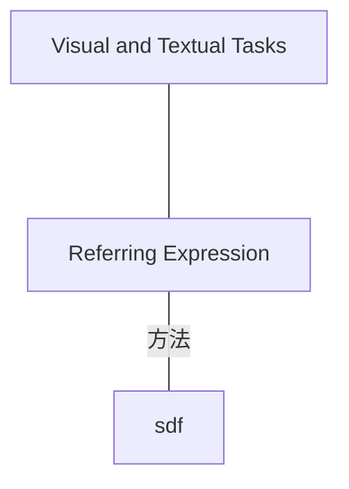
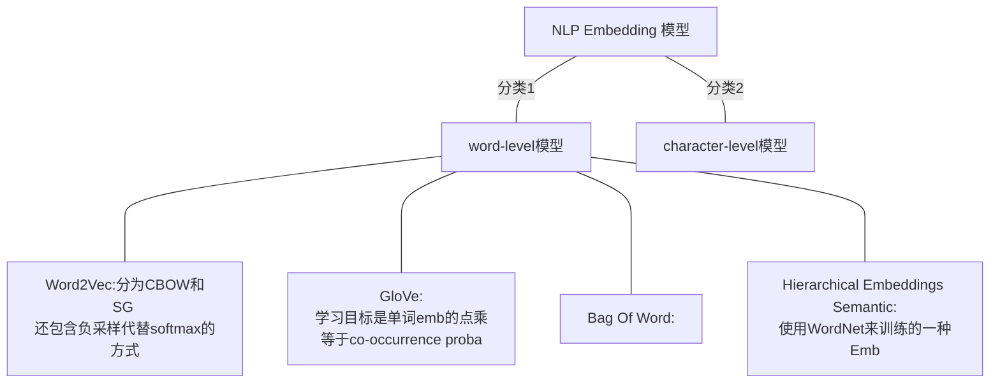
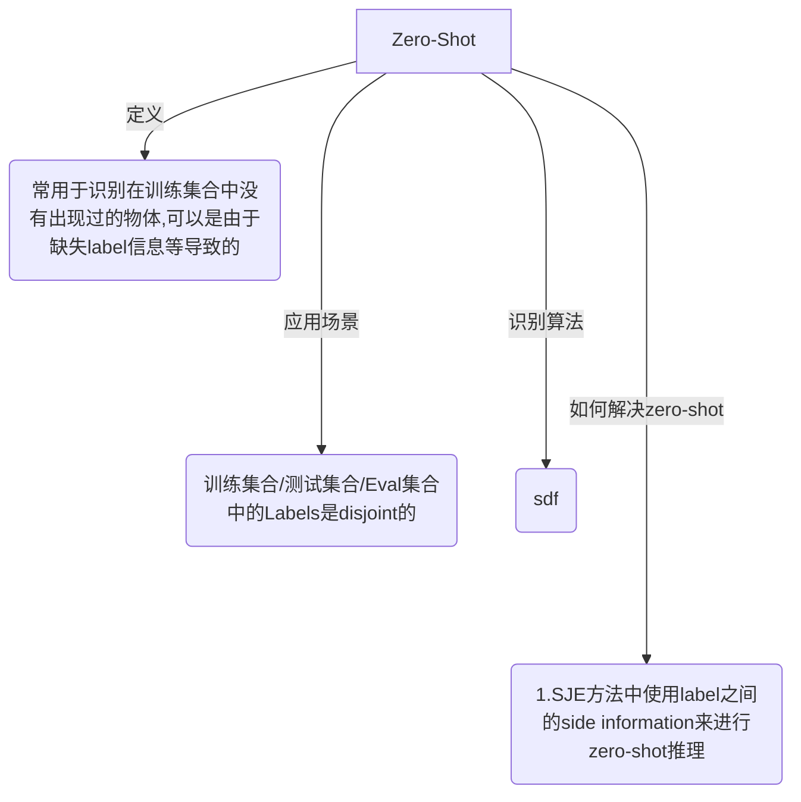

#### 深度学习

[介绍CNN的可视化发展过程](https://zhuanlan.zhihu.com/p/24833574)：知乎的介绍CNN卷积核可视化的文章，也许对其他的可视化过程也可以有启发。

#### RE

论文： Inter- pretable and globally optimal prediction for textual ground- ing using image concepts.

## Tasks and Methods Related to Referring Expression

## NLP - WordNet

#### 导图

展示各类的NLP embedding模型的方法。

## Knowledge Graph of Zero-Shot Learning(ZSL)

#### 导图

#### 参考文献：

1. [Zero-Shot Learning Survey 2017年](https://arxiv.org/pdf/1707.00600.pdf)

## 论文阅读模版

变主动为被动，由被动传授转化为主动获取型方法，先定义主要问题，然后搜索答案，其次搜集启发，最后拾遗。

对于阅读论文来说，我们定义主要问题的一些模版：

1. 这个论文的---年限/会议/单位是什么？
2. 这个论文使用的数据是什么？
3. 这个论文的任务是什么？
4. 这个任务当前的难点是什么，和自己的任务有什么相关性。
5. 这个论文的最大创新点是哪些？
6. 每个创新点分别是在模型的那些步骤得到解决的？
7. 这个模型的训练流程？

## CVPR 2017

1. 这个论文的---年限/会议/单位是什么？
2. 这个论文使用的数据是什么？
3. 这个论文的任务是什么？
4. 这个任务当前的难点是什么，和自己的任务有什么相关性。
5. 这个论文的最大创新点是哪些？
6. 每个创新点分别是在模型的那些步骤得到解决的？
7. 这个模型的训练流程？

---

1. 当前的方法使用 Attribute？这些 Attribute 怎么使用的，哪些文章用的？

2. Attribute的缺点是什么？

   一个是：Attribute如果想要进行fine-grainned 分类需要更多的标签

   二个是：Attribute如果难以提供NLP接口？

3. 这个文章使用什么解决了这个缺点？

4. 这个文章基于的文章是：

   [Evaluation of Output Embeddings for Fine-Grained Image Classi- fication. In CVPR, 2015.]()   --- SJE

5. 主要贡献：

   1. 提出了两个数据集。提供了额外的caption数据：鸟+花
   2. 对4中的文章进行了拓展，可以端到端，可以用于zero-shot retrieval任务。
   3. 对比：字符Emb模型 + wordEmb模型 + 混合CNN-LSTM NLP Emb模型。第三个是自己提出的。

6. Extension of Structured joint embedding 模型是什么？这个模型缺点？这个模型针对什么任务？如何改进的？

   ESJE方法使用的是Attribute等提取的离散文本信息来作为retrievel，28.4%弱监督精度相比于 50%的Human Attribute强监督。

   

7. Zero-Shot 场景是啥？ 

   答： Zero-Shot场景就是，target classes 在 Train Val Test 3个集合上都是disjoint。然后Zero-Shot Learning可以通过挖掘classes之间的关系来判断zero-shot classes

8. [SJE](#SJE) 方法结果表示：1. 视觉特征中，GoogleNet比FV和AlexNet特征好。 2. Unsupervised特征中，text-based unspervised效果最好，wordnet其实效果一般。 3. human attribute中连续特征比离散特征好。 4. 多特征融合可以有cnc和cmb两种方式，其中各有千秋，可以作为调参方式。 5. 联合使用Word2Vec和fine-grained document来进行若监督训练output embedding（class embedding）

9. [SJE](#SJE) 实验过程有时间可以学习一下。构建一个 zero-shot learning的branch mark就好了。因为高水平CV会议一般需要多个数据集验证。更好的是多个任务验证方法的有效性。