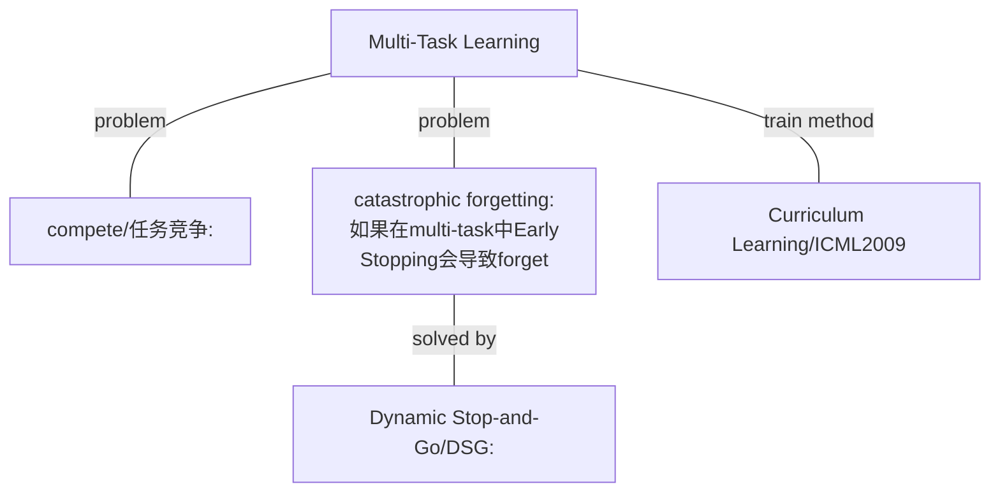
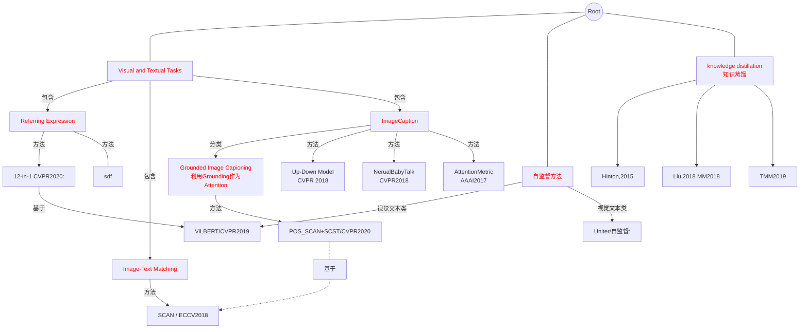
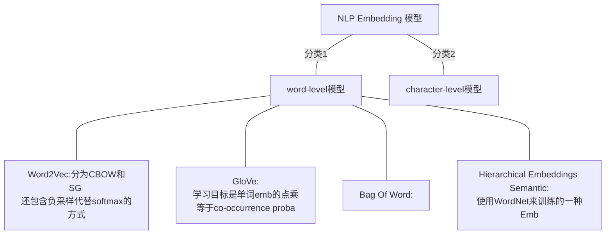
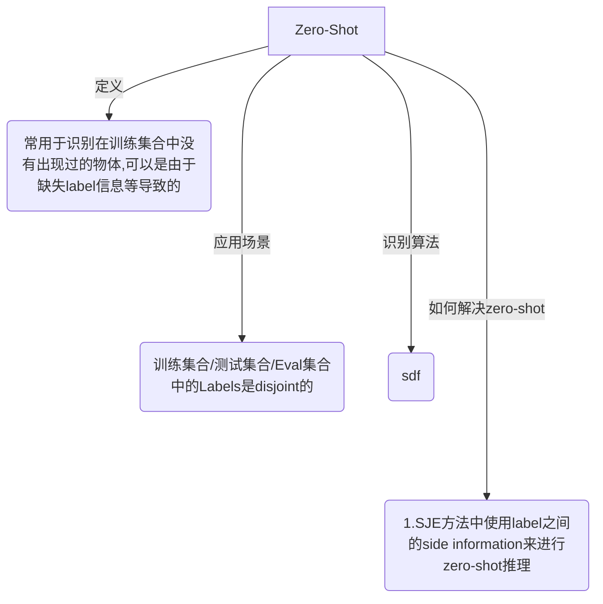

#### 深度学习

[介绍CNN的可视化发展过程](https://zhuanlan.zhihu.com/p/24833574)：知乎的介绍CNN卷积核可视化的文章，也许对其他的可视化过程也可以有启发。

#### RE

论文： Inter- pretable and globally optimal prediction for textual ground- ing using image concepts.

## Multi-Task Learning Basis

## Tasks and Methods Related to Referring Expression

##### CVPR2020:12-in-1

1. 最主要的创新是啥：引入了Multi-Task Learning。共享Emb的方式来建立Task的连接。

2. 基于的模型和论文： ViLBERT  [论文地址](https://arxiv.org/abs/1908.02265) CVPR2019

   总而言之，ViLBERT是一个文本和视觉的联合自监督预训练网络。使用2个并行TRM进行Inner-Modality特征提取。同时还有Co-TRM进行Inter-Modality提取。输入为IMG R0 R1 .. Rn CLS w0 w1 ... wm SEP。其中IMG和CLS作为视觉和文本两个Emb。2个自监督任务(proxy tasks)：Multi-Modal alignment prediction / Masked Multi-Modal Modelling。 

3. 贡献点：

   1. 提出了Multi-Tasks训练框架/方法，可以防止数据泄漏(因为图片互相引用)：直接删除所有任务中出现在其他测试集合中的Image。然后约11%reduction average cross datasets
   2. 在12个数据集，4个任务上进行了训练。270M -> 12M 模型参数
   3. 首先12-in-1训练，然后进行fine-tune可以达到平均涨点2%

4. 解决多任务训练问题：任务大小和难度都不同

   1. 使用三个技巧解决：Pretrain + DSG + Round-Robin Batch Sampling
   2. 海量超参数问题：single task pretrain 然后选择最合适的，然后组合就行。
   3. 线性 Warmup 很有用
   4. LossScaling：公共模型参数学习率设置为最小的学习率，然后Loss进行Scale来适应对应的学习率。

5. 如何处理Visual + Textual关系：(Grounding)
   $$
   Score = W_r * h_{vi}
   $$

##### SCAN

label:scan

1. SCAN的简写是： Stacked Cross Attention Network
2. SCAN框架是隐空间模型。
3. SCAN视觉模型：Bottom-up attention network。语言模型GRU。
4. SCAN的Grounding框架：首先计算word-region scores，然后通过第一步的计算Image-Sentence scores。
5. Image-Text Stacked Cross Attention：
   1. ith region：计算出 vi 和 ai，其中ai是image-region对words的加权和。
   2. 通过cos(ai, vi)表示Region-Sentence Sim
6. Text-Image Stacked Cross Attention：和5类似，只是方向相反。

##### [More Grounded Image Captioning by Distilling Image-Text Matching Model]()

label:pos-scan

1. 论文地址：可以在mendeley中看到原文。

2. POS-SCAN基于的方法是SCAN，将SCAN的Grounding方法引入了caption中：首先在数据集上训练一个改进的POS-SCAN模型，然后使用知识蒸馏的方式将POS-SCAN模型引入到Caption的Attention模块中，使用KL散度对Captioner添加一个蒸馏Loss。
   $$
   l_1(\theta) = \sum_{t=1}^{n}\{-\log(p_\theta(y_t^*|y_{1:t-1}^*)) + \lambda_1 \mathbb{I}_{y_t^*=y^{none}} KL(\beta_t||\alpha_t) \}
   $$
   其中的\alpha是POS-SCAN预测的attention，而\beta是Captioner的Attention LSTM变换得到的Attention。

##### [Nerual Baby Talk](https://openaccess.thecvf.com/content_cvpr_2018/CameraReady/0205.pdf")

label:nerual-baby-talk

CVPR2018：mendeley中存在

1. 基于2011年的Baby Talk模型。将其中的基于Templete+CRF模型改为了GenerateTemplete + Visual Word Based Region
2. 提出了两种词汇： visual word + textual word
3. 在CaptionFormular的基础上提出了GroundCaptionFormular
4. 在Sec 3.2 Caption Refine的Filling环节上：首先是预测单复数，然后预测refined-categories。例如dog -> puppy等。依赖的输入是region的视觉特征和ht。
5. 本方法的Grounding是Explicity Grounding[\ref{POS-SCAN}]。即我们对不同的region就是找到对应的Grounding的Words。
6. 未全看完

##### [Attention Correctness in Neural Image Captioning](https://www.google.com/url?sa=t&rct=j&q=&esrc=s&source=web&cd=&ved=2ahUKEwjbtrP85bfvAhVOQd4KHTaDDbQQFjABegQIAhAD&url=https%3A%2F%2Fojs.aaai.org%2Findex.php%2FAAAI%2Farticle%2Fview%2F11197%2F11056&usg=AOvVaw3o9xdu-s6V_BrpXMHjd53s)

label:AttentionMetric

1. 摘要表示：这个论文的工作是探索Caption模型中的Attention机制是否足够强大，是否足够有效？首先提出了一个Attention的Metric来表示Attention是否对应的比较好。其次，提出了一个模型，使用显示的强监督来对AttentionMap进行一个正则化（多任务Loss）。最后回答了，自己提出的AttentionMetric越好，那么相同的模型的Caption的BLEU4也越好。Flick30k test： 28.1
2. 未全看完

## NLP - WordNet

#### 导图

展示各类的NLP embedding模型的方法。

## Knowledge Graph of Zero-Shot Learning(ZSL)

#### 导图

#### 参考文献：

1. [Zero-Shot Learning Survey 2017年](https://arxiv.org/pdf/1707.00600.pdf)

## 论文阅读模版

变主动为被动，由被动传授转化为主动获取型方法，先定义主要问题，然后搜索答案，其次搜集启发，最后拾遗。

对于阅读论文来说，我们定义主要问题的一些模版：

1. 这个论文的---年限/会议/单位是什么？
2. 这个论文使用的数据是什么？
3. 这个论文的任务是什么？
4. 这个任务当前的难点是什么，和自己的任务有什么相关性。
5. 这个论文的最大创新点是哪些？
6. 每个创新点分别是在模型的那些步骤得到解决的？
7. 这个模型的训练流程？

## CVPR 2017

1. 这个论文的---年限/会议/单位是什么？
2. 这个论文使用的数据是什么？
3. 这个论文的任务是什么？
4. 这个任务当前的难点是什么，和自己的任务有什么相关性。
5. 这个论文的最大创新点是哪些？
6. 每个创新点分别是在模型的那些步骤得到解决的？
7. 这个模型的训练流程？

---

1. 当前的方法使用 Attribute？这些 Attribute 怎么使用的，哪些文章用的？

2. Attribute的缺点是什么？

   一个是：Attribute如果想要进行fine-grainned 分类需要更多的标签

   二个是：Attribute如果难以提供NLP接口？

3. 这个文章使用什么解决了这个缺点？

4. 这个文章基于的文章是：

   [Evaluation of Output Embeddings for Fine-Grained Image Classi- fication. In CVPR, 2015.]()   --- SJE

5. 主要贡献：

   1. 提出了两个数据集。提供了额外的caption数据：鸟+花
   2. 对4中的文章进行了拓展，可以端到端，可以用于zero-shot retrieval任务。
   3. 对比：字符Emb模型 + wordEmb模型 + 混合CNN-LSTM NLP Emb模型。第三个是自己提出的。

6. Extension of Structured joint embedding 模型是什么？这个模型缺点？这个模型针对什么任务？如何改进的？

   ESJE方法使用的是Attribute等提取的离散文本信息来作为retrievel，28.4%弱监督精度相比于 50%的Human Attribute强监督。

   

7. Zero-Shot 场景是啥？ 

   答： Zero-Shot场景就是，target classes 在 Train Val Test 3个集合上都是disjoint。然后Zero-Shot Learning可以通过挖掘classes之间的关系来判断zero-shot classes

8. [SJE](#SJE) 方法结果表示：1. 视觉特征中，GoogleNet比FV和AlexNet特征好。 2. Unsupervised特征中，text-based unspervised效果最好，wordnet其实效果一般。 3. human attribute中连续特征比离散特征好。 4. 多特征融合可以有cnc和cmb两种方式，其中各有千秋，可以作为调参方式。 5. 联合使用Word2Vec和fine-grained document来进行若监督训练output embedding（class embedding）

9. [SJE](#SJE) 实验过程有时间可以学习一下。构建一个 zero-shot learning的branch mark就好了。因为高水平CV会议一般需要多个数据集验证。更好的是多个任务验证方法的有效性。