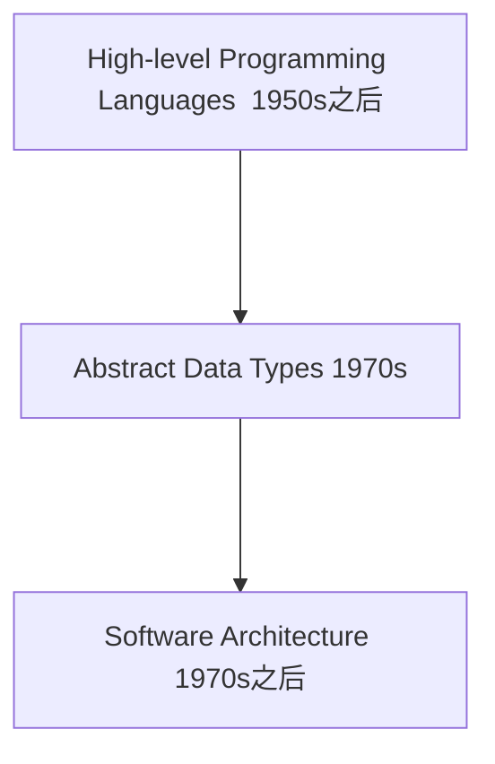
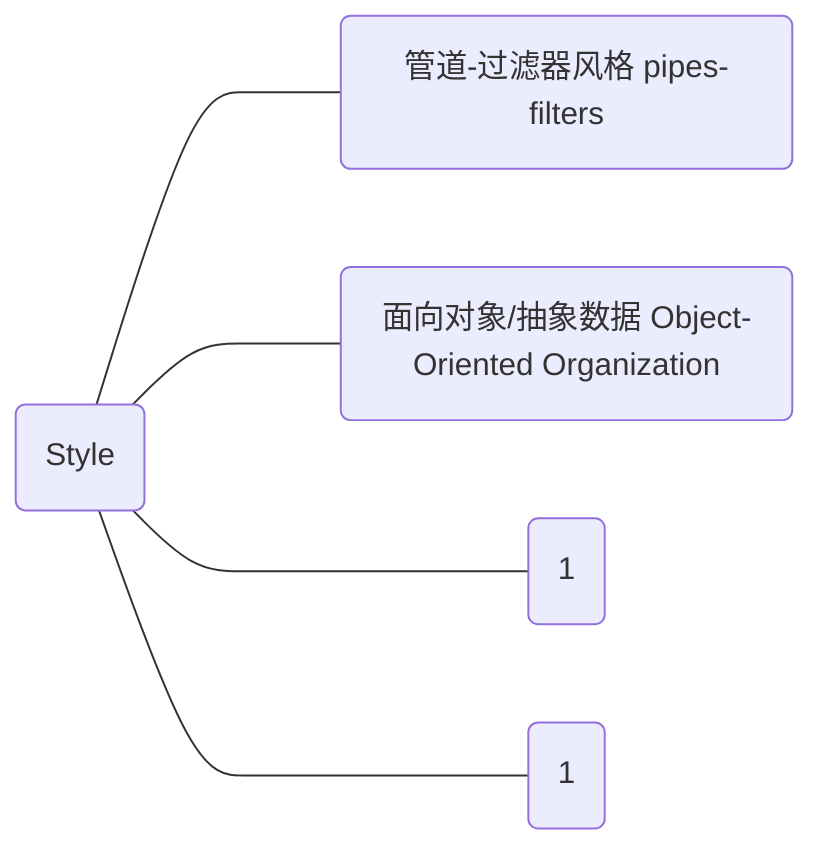
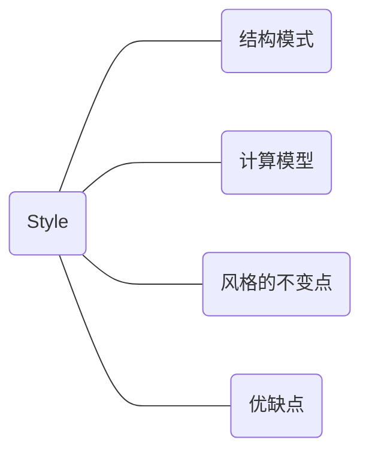
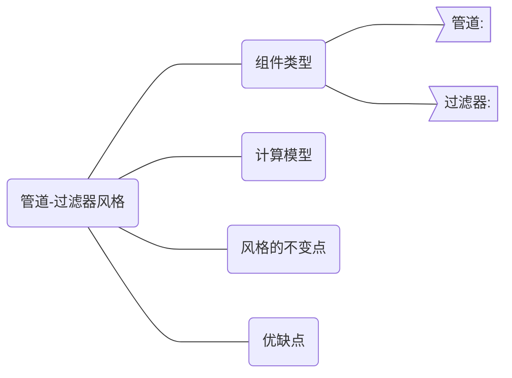

## 1. 软件体系结构发展历史

#### 1.1 发展核心思路：

1. 复用系统
2. 复用设计

#### 1.2 从语言到体系结构：

#### 1.3 例子：

X Window System

NIST/ECMA Reference Model

#### 1.4 体系结构风格定义：

{ Components + Connectors + Constrains }

来源： 1970s年之后的文献频繁出现的名词和设计方法，被称为软件结构风格 / 软件模式。

#### 1.5 与其他学科的关联

1. 软件工程：
2. 设计模式：

## 2. 软件体系结构风格概览

#### 2.1 风格概览

#### 2.2 风格的共性

将从如下几个视角来考察不同的软件体系结构风格。

#### 2.3 管道-过滤器风格

###### 管道的概述

###### 重点

###### Shell解释器具有管道功能：

#### 面向对象

[样例展示](/Users/xiongkun/Desktop/qz/电子商务中的软件体系结构/百度APP新闻推荐项目.pptx)

