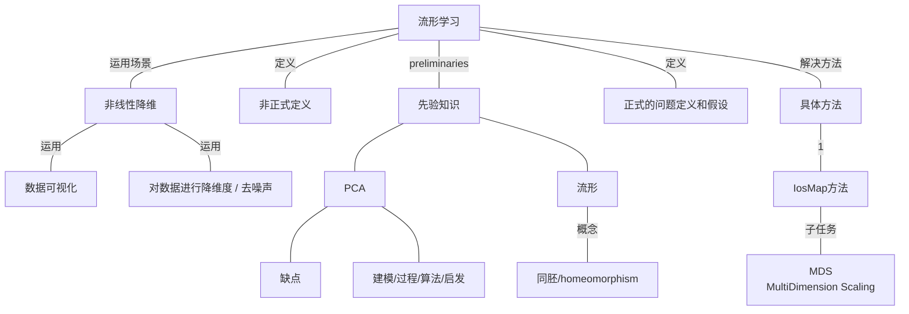

## 参考文献

[Algorithms for manifold learning](http://cseweb.ucsd.edu/~lcayton/resexam.pdf)

##### 主观直觉

1. 一个数据集中，存在很多不同的特征，但是这些特征有很大的相关性。因此可以进行降维度。 ==>  数据是高维空间中的低维度流形表示。其中高维空间是特征空间，流形空间是数据的underlying parameters。

##### 流形学习定义 

从高维特征空间中挖掘出潜在低维度流形空间的方法叫做流形学习。

##### Perliminaries

1. ***Linear Dimensionality Reduction Methods***:  PCA / 
2. ***Manifolds***: 

##### 流形学习问题定义

1. 数据点为存在于D维空间的d维流形的采样
2. 流形只有一个coordinate chart f。即可以被一个坐标映射表示。

##### 需要学习的概念

1. Geodesic Distance 测地线距离
2. Multidimensional Scaling (MDS)

##### ISOMAP方法

假设：

1. Isomap假设：假设流形存在一个从R^D -> R^d 的映射，使得映射前和映射后是保距离的。
   $$
   ||f(x_i) - f(x_j)|| = G(x_i, x_j) ；其中G是流形上的测底线距离。
   $$
   

总体步骤：

1. 计算Geodesic Distance。构造Dissimilarities Matrix：D
2. 转化为MDS任务来学习映射。原始的Isomap使用cMDS方法来解决MDS子任务。

##### MDS任务和解决方法

