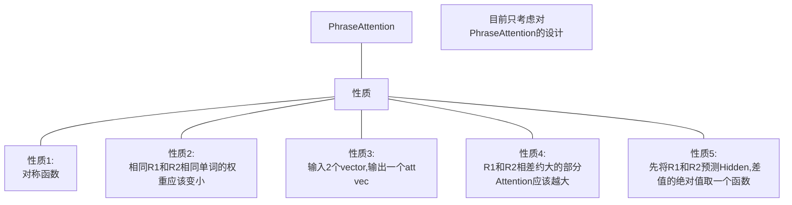
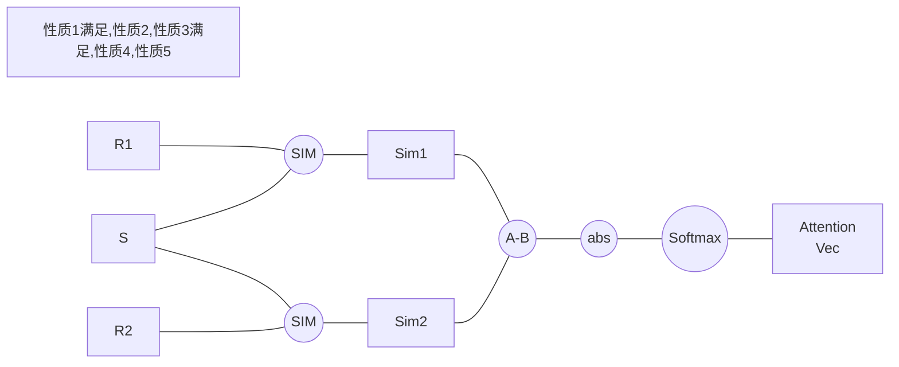

#### 背景

1. 发现SCAN的Stack Cross Attention方法可以学习到很好的对应关系，78%GT精度左右，然后case study中可以看到很好的效果。

2. case study 中，单纯的SCAN方法虽然效果不错，但是如果直接将分数进行累加，容易出现覆盖情况：

3. ***<font color='blue'>覆盖现象！</font>***：man in black，因为man比较多，black比较少，所以man的权重会普遍高于black，因此man会起到决定性的作用，但是其实应该是black起到决定性的作用。man in black，如下case：

   

4. 如果将LSTM得到的hidden vector作为keys，然后LSTM的输入word emb作为vatelues，regions作为query，可以得到一个attention方法，这个方法通过建模$P(W_i|S,R)$条件概率来作为Attention。效果是 80%左右

5. 分析得到，对于不同的pair来说，单词的重要性其实应该不同才对。所以引入对$P(R_1 > R_2|S)$的建模，通过这个概率来进行计算。加权。

#### 算法整体框架

1. Eval阶段统一成为$O(n^2)$的复杂度：针对所有的regions，设置为regions pair。inference的时候，首先将proposals的pairs展开为$n^2$个pairs，然后对每个pairs计算attention，然后进行加权，计算两个的得分差。然后使用BPR-LOSS来作为概率统计。最后vote机制概率最大的作为最终的形状。**由于使用了BPR-LOSS，因此不使用Cosine Similarity。而是使用dot作为结果**


$P(R_1 \gt R_2|S) = \mathbf{Sigmoid}(\mathbf{Score}(R_1,R_2,S) - \mathbf{Score}(R_2,R_1,S))$

$\mathbf{Score}(R_1,R_2,S) = \mathbf{CM}({\mathbf{PhraseAttention}(R_1,R_2,S)}, R)$

文字表示就是，首先计算一个Score的分值，从[-inf, inf]。这个输出表示logits。然后通过两个Region对S的每个word进行一个PhraseAttention。目的是使的不同的单词的重要性随着R的不同而不同。CM是跨模态的评分函数。

```python
def PhraseAttention(R1, R2, S):
		"""输入R1和R2两个区域的特征，S是文本的特征
		   输出vector表示最后的文本Attention之后的文本向量。
		"""
		return 
  
def CM(textual_vec, visual_vec):
  	"""输入文本的向量和视觉的向量
  	   输出两个向量的评分。[-inf, inf]
  	"""
    
def BPR_LOSS(S1, S2):
  	return -ln(sigmoid(S1-S2))
```

#### 先验知识



综上，思路是，首先通过R1和R2计算出Region与单词的不同相似度。然后对相似度高的取低值。。。所以初步设计为： 




#### 实验设计

1. BPR Loss 是否有效？可以直接用在 SCAN-LSTM里面试试！更改Loss即可。
2. 


#### Next Idea

【21年6月29日】

1. MattNet的Modular各个部分的作用大小不同。那么他的权重是否合理。权重直接由 phrase 进行计算出来。显然是不合理的。这个是一个动机很大的改进点。这个也就是对比的重点。
2. 在MattNet中融入场景图，改良 Relation 模块。【这个也是一个出发点。】
3. 从不同的 Infer 流程来进行创新。【！！！Going】
   1. 举个例子，本来希望的是 phrase + region -> score 然后得到最大值。这个是N个里面比较选最大。不符合对比过程。
   2. 修改infer流程，成为了 phrase + regionA + regionB -> 选择。这样两两对比，逐步增加，可以使得每一步对比更加精确。
   3. 修改infer流程，依次筛选phrase中的属性。例如筛法等。
   4. <font color='red'>反正这个思路的关键之除在于，选择与众不同的Infer过程，然后按需进行个性化设计</font>
   5. 强化学习Inference（0/1 Inference；然后进行强化学习Loss）


#### 实验结果

基于的方法是 SCAN-LSTM-HARD，具体的修改在 SCAN-LSTM-PAIRWISE 上面。

| 方法        | 结果  | 说明                                                         |
| ----------- | ----- | ------------------------------------------------------------ |
| BPR-LOSS    | 77%   | 将BPRLoss替换为Maxmargin-Loss                                |
| dot-product | 81.6% | 将Cosine-Similarity替换为了Dot Product。<br>增加了similarity的取值范围到[-inf, inf]。效果提升不大。 |
|             |       |                                                              |

