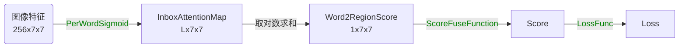
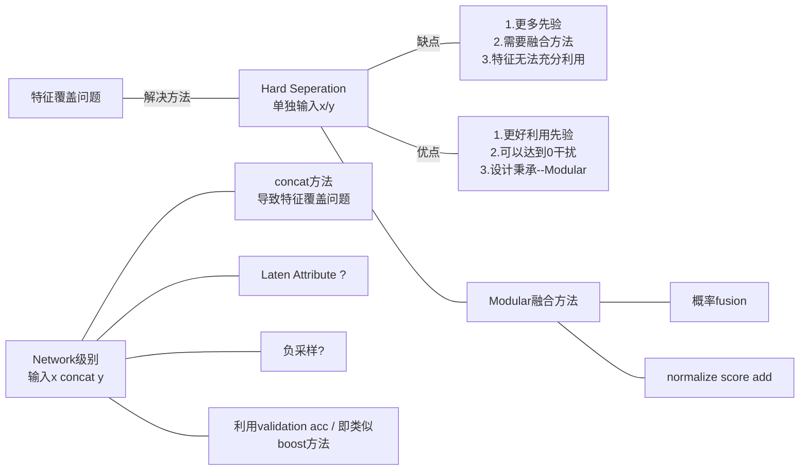
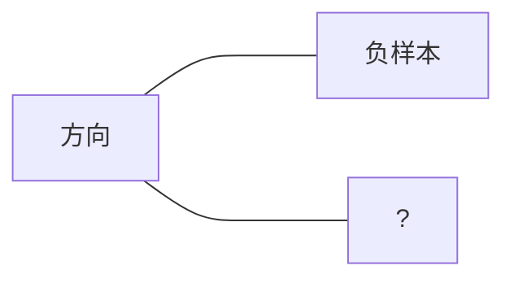

状态： <font color='red'>设计阶段</font>

### 背景

1. 通过case study发现，其实很多时候，一些属性并没有被很好的学习。应该是大部分的noun和abs location已经可以很好的区分出物体对象。因此其他的信息被使用比较弱。
2. 颜色等的区分度其实不够高。例如 white 和 blue 。例如搜索blue car ，会出现很多的白色车。这个问题很奇怪。这说明即使对于简单的短语，这种类型的错误其实也有很多。
3. 观察到，在原始的方法中，添加了Attribute Predict方法，其实效果不是很好。应该是模型设计的不合理，否则会增强预测的能力。初步估计模型的走了捷径。因此希望设计出一个重复利用word emb的Attribute Branch来强化属性单词和Region的对应关系。

### 思考

1. 判断这个问题是不是瓶颈问题？这个问题是噪声还是普遍存在的现象。从原始的数据集中筛选出一个数据集，数据集中只包含简单的color + none。查看这个问题是否值得解决？

   <font color='green'>具体的带颜色的物体识别率偏低，这个的原因目前不是很清楚，但是知道这个问题是一个统计上的问题，不是针对特殊的case。而且word2region类的方法中，使用right/left等loc词的匹配准确率很高。说明网络对loc相关的单词进行了很好的匹配。</font>

2.  <font color='red'>思考具体出现上述颜色匹配异常的原因？</font>

   1. 是否因为特征的原因？使用更加低阶的特征试试？
   2. 是否1-Stage可以缓解，如果在CNN的同时就引入phrase是否可以缓解这个问题？

3. <font color='red'>观察：部分数据集和整体数据集训练后在测试集合的结果都是一样的，联合训练和单独训练，精度都是差不多的，几乎一摸一样？ </font>

   1. 说明：网络拟合能力足够！train acc可以到99%，而且互不影响。
   2. 说明：网络设计原因导致网络无法很好的捕捉到“输入特征”->颜色的对应关系。因此要添加输入特征 / 更改网络结构。
   3. 说明：这个问题，应该需要添加特征/提取有效特征。而不是训练Loss的原因。因为这个问题属于输入到输出的对应关系不明显的问题。而且拟合能力也够了。

### 实验

##### 筛选subdataset

为了更好的验证[思考1](#思考)的正确性，证明这个问题确实是一个瓶颈，设计本实验

首先由于MattNet中具有的Attribute数据集可以用来筛选出一些句子的语法结果。因此我们通过筛选的方法构造了三个SubDataset数据集。这几个数据集都是通过Referit-fast数据集中选取了部分子集。筛选方法就是对sentence的单词个数和attribute中的信息进行筛选。

| 数据集     | 代码                  | 统计信息                             |
| ---------- | --------------------- | ------------------------------------ |
| color_noun | filter_color_noun:345 | 训练集合：150迭代/Epoch ； 测试450个 |
| loc_noun   | filter_loc_noun:351   | 训练集合：测试3800个                 |
|            |                       |                                      |

实验结果：

| 数据集[complete上训练] | ACC@1[GT] |
| ---------------------- | --------- |
| color_noun             | 73%       |
| loc_noun               | 93%       |
|                        |           |

说明，当前的训练的模型，对于loc之类的单词其实具有很高的辨识度，但是至少对于颜色来说，其实不具有很好的辨识度。应该是颜色相关的低阶特征没有被提取出来。因为即使在上述数据集中进行单独训练，也很难得到有效的训练结果。训练精度99%，但是测试精度还是70%左右。因此这个问题目前看起来比较严重。70%的颜色识别率是很低的。具体原因在什么地方呢？

### 实验：低效特征？

##### 方法调研

调研之前的人都是怎么来强化color之类的属性的？

| 论文/方法名称 | 方法简介                 | 亲自实验有效性 |
| ------------- | ------------------------ | -------------- |
| MattNet       | 使用低层的颜色来进行预测 |                |
|               |                          |                |
|               |                          |                |

##### 实验：Inbox Attention （模型设计角度、整体-局部）

<font color='orange'>实验思路：</font> 如果只对于Noun和Color这一类的词语，如果使用Inbox Attention也许会有作用。因为属性和一些整体-局部描述其实关键在于这个对象在图像内部，因此强调出这个对象的特征就很关键。现在的方法只是使用FC来提取，这样的FC来对图像进行转化的模型，其实对于图像256x7x7的特征来说不好，因为这样的直接FC主要是针对不同位置给出不同的权重。而图像特征的权重应该通过内容计算出来，而不是位置。所以计算出一个 1x7x7的分值表示不同位置的权重，权重的数值用来区分颜色属性。

因此引入如下的：InnerBox Score框架

$L$是句子的长度。对L中每个单词都计算一个AttentionMap。



<font color='orange'>实验设计：</font> 

ScoreFuseFunction $\in$ [Sum, FC, Conv, ]

PerWordSigmoid $\in$ [FC, ]

LossFunction $\in$  [MaxMargin, ]

<font color='orange'>实验结果：</font> 

| 方法组合[ScoreFuse+PerWord+Loss] | 结果[acc@1 GT all] | 说明 |
| -------------------------------- | ------------------ | ---- |
| Sum+FC+MaxMargin                 |                    |      |
|                                  |                    |      |
|                                  |                    |      |

##### 实验：低阶特征 （特征失效角度）

实验思路： 添加额外的低阶层特征 / CNN网络包含进入网络 / 1-Stage？

### 颜色实验[2021-06-01]

```Keyword： 特征覆盖问题提出```

```代码位置： cvpack2_model/word2region/SCAN-LSTM-COLOR```

为了对MattNet中颜色寻找不准确的问题，调研了一些之前的论文之后，得到一些解决方法：颜色直方图。通过将颜色直方图用于Color+None的子数据集进行试验，可以得到 train_acc 90%，top1 88%的准确度，相比mattnet的 76%提高了 12%个百分点。充分说了特征的有效性和非过拟合性。**但是目前存在特征覆盖问题。**

***特征覆盖问题： ***如果网络中有两种特征的串联：(X, Y)预测任务T。其中X特征很大，Y特征很小。但是X特征对$Attr_1(T)$很有帮助。而Y特征对$Attr_2(T)$很有帮助。但是X特征由于充分大，因此只利用X特征也可以得到很低的训练误差:ACC=99%，但是是过拟合状态，因为 Val ACC=70%左右。<font color='red'>怎么对于$Attr_2(T)$强化Y特征，而其他的方面强化X特征？</font>

使用Modular方法设计，分离作用域，研究特征融合方法： 

符号定义：$x, y$为两种特征，$s_i = f(x, l_i)$ 作为特征到label的相似度映射。$s_i \in \R$ 。

如下几个思考方向：



### 特征覆盖问题 branchmark + experiments

问题定义和实验协议： 

对于Model、Network级别的设计来说，要达到如下目的：

输入特征为 (X || Y)，而模型需要对下述三个任务满足精度标准，不低于单独训练标准（因为特征更多了，不应该更差）

1. 对于Color数据集精度需要 ~ 88%

2. 对于Relation数据集精度需要 ~ 93%

3. 对于All精度需要 ~ 84%

如果满足输入和上述三个，那么证明，设计的模型、训练算法、融合方法可以充分利用特征，并避免了特征覆盖问题。这样可以融合使用多个特征，达到一个总体训练框架。插拔式的RE训练框架。

<font color='red'>所以问题关键是，如何寻找到这样一个避免特征覆盖的特征融合网络</font>



<font color='orange'>实验结果：</font> 

| 方法                                                   | Color                                                        | Location                                       | All                    | 说明                                                         | 总结                                                         |
| ------------------------------------------------------ | ------------------------------------------------------------ | ---------------------------------------------- | ---------------------- | ------------------------------------------------------------ | ------------------------------------------------------------ |
| HardSep(Add)<br><font color='green'>Done</font>        | $\alpha=0.5$<br>83.9%<br>$\alpha=0.3$<br>84.7%<br>$\alpha=0.1$<br>88.8% | $\alpha=0.5$<br>93.1%<br>$\alpha=0.1$<br>77.9% | $\alpha=0.5$<br/>84.8% | HardSeperation方法中的<br>将不同Modular进行加和<br>$f(x,y,l_i) = f(x,l_i)+\alpha f(y,l_i)$<br>st. $\alpha = 1$ | $\alpha$只是一个调和参数，其实最后精度处于之间。无法达到理想的效果。 |
| LatenAttribute<br><font color='red'>Designing</font>   |                                                              |                                                |                        | 核心思想是通过将Sentence进行分解<br>最后得到word和features的对应关系。 |                                                              |
| HardSep(Prob + Mul)<br><font color='red'>Runing</font> | 88.2% -> 87.7%(-0.5%)                                        |                                                |                        | 核心思想是将score转化为概率。然后<br>通过概率的链式法则得到Mul的方法。 |                                                              |
| BPR-LIKE-PROB？<br><font color='red'>Designing</font>  |                                                              |                                                |                        |                                                              |                                                              |
|                                                        |                                                              |                                                |                        |                                                              |                                                              |
|                                                        |                                                              |                                                |                        |                                                              |                                                              |

### 总结

首先弄明白问题的出现在哪： 

1. 如果是两个SubDataset任务都训练的很好，但是集成到一起就训练不好。这说明可能是“任务干扰”。需要找到冲突的特征。一个方法是使用Modular的方式进行训练。
2. 欠拟合：训练的过程中网络拟合能力不足导致的错误。这个需要更改网络。
3. 过拟合：训练集合表现很好，但是测试集合表现不行。这个现象可能是“拟合过强” 。也可能是“低效特征”。低效特征+过强的拟合网络会导致过拟合现象。<font color='red'>【TODO证明：人工构造数据然后看看是否有这个情况出现】</font>
4. Attention的核心不在于什么相似度。这个只是一个解释。核心动机在于“位置无关，内容相关“。而与之相法的就是FC和Conv就是位置相关。
5. 对特征覆盖free的寻找。