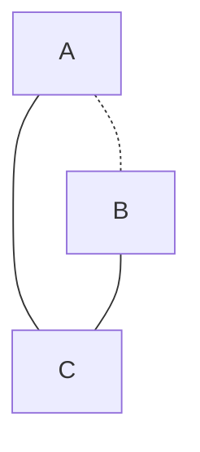

#### 背景

在学习连续马尔可夫随机过程的时候，slides中说，因为马尔可夫对时间t具有马尔可夫性质（memoryless），因此可以推到出$T_i$ 随机变量是一个指数分布的RV。

因此带来了一个问题，是否所有满足无记忆/马尔可夫性质的RV都是指数分布变量呢？

#### 抽象

首先为了解决这个问题，主要是抽象出主要问题在哪。也就是那个部分是最难解决的，然后抽象出来，使用Polya联想记忆解题法来解决这个问题。

#### 建模无记忆性

无记忆性是马尔可夫性质的别名，连续模式下的无记忆性是转移发生RV $T_i$​需要满足如下性质：$P(T_i>s+t | T_i>s) = P(T_i>t)$ 。需要证明的是，如果一个RV满足上述的连续时间无记忆性，那么这个RV一定是指数分布。

**Theorem**： 如果一个RV:  X 满足$P(X>t+s|X>s) = P(X>t)$​，那么X一定满足指数分布。

**Prove**：

根据无记忆行，可以得到如下的性质：$P(X>t+s) = P(X>t) * P(X>s)$ 。可以看出$P(X>x)$满足R上的乘性函数。

接下来证明，如果一个函数  $f(x+y) = f(x)f(y)$ ，那么$f(x)$一定是一个指数函数。

首先考虑到类似的性质的抽象函数，$f(x + y) = f(x) + f(y)$ ，这个是线性函数，而且有结论线性函数一定是线性形式，假设正确，是否可以将乘性转化为线性。考虑到 $lnf(x + y) = lnf(x) + lnf(y)$ ，这个是个线性函数，因此可以得到 $lnf$​ 是一个线性函数。因此$f = e^{cx}$ 的形式。所以 f 是一个指数函数。

其次来证明线性函数一定满足 y = cx 的形式。如果直接证明不好证明，那么可以从 y = cx 入手，思考哪些性质容易被证明 ？考虑到导数，因为 y = cx 的导数一定是常数，而常数函数容易证明。因此对线性函数两边求导 

$f'(x+y) = f'(x)$ ，而这个形式就是常数的函数的形式，所以可以得到  $f' = c$，即$f = cx + b$ ，最后验证如果b != 0 不满足形式，因此 $f(x) = cx$​ 的形式。

最后联合上面的所有结论，问题得以证明。

$\square$

#### 总结

这个问题花费了1h左右的时间。

完善了证明方法。如果想要证明一个满足性质A的对象，也满足B，其中A是未知的，B是已知的，可以从B出发，探索出A和B的共性，而且这个共性可以得出某些结论，那么久很用作用。图示如下： 

可以使用C做中转。例如上面就是线性函数和常数函数。
