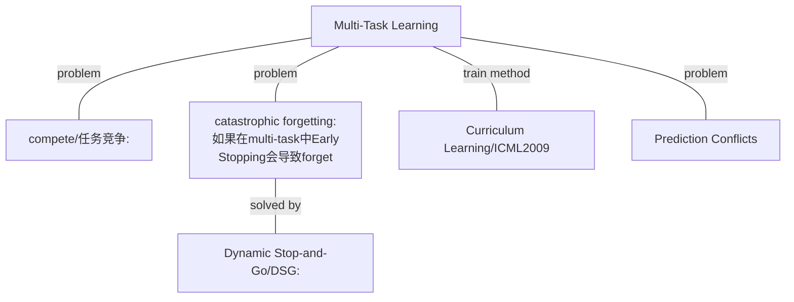
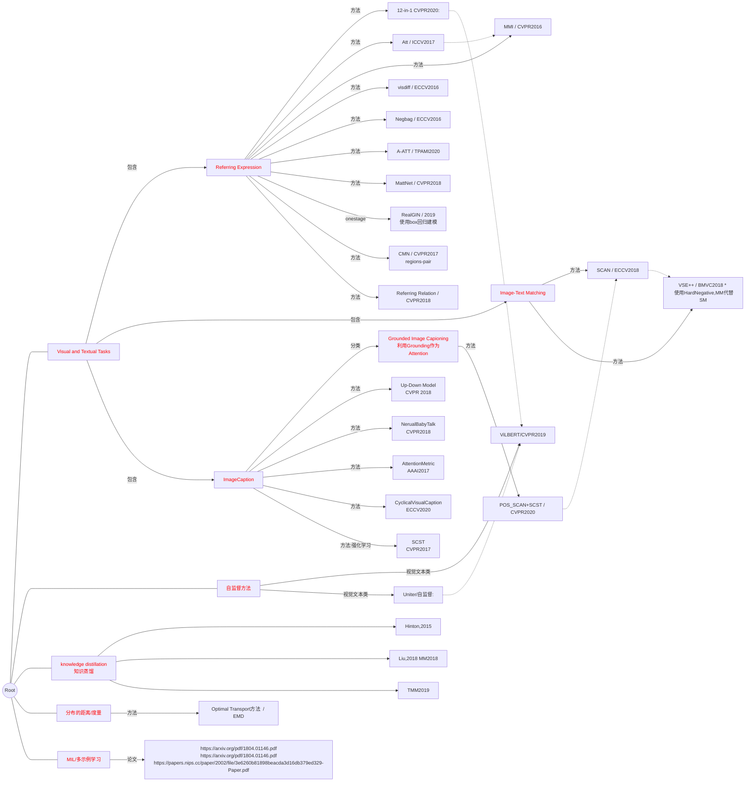
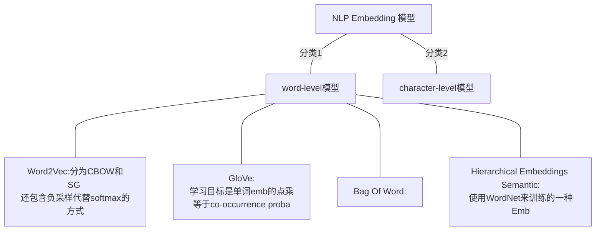
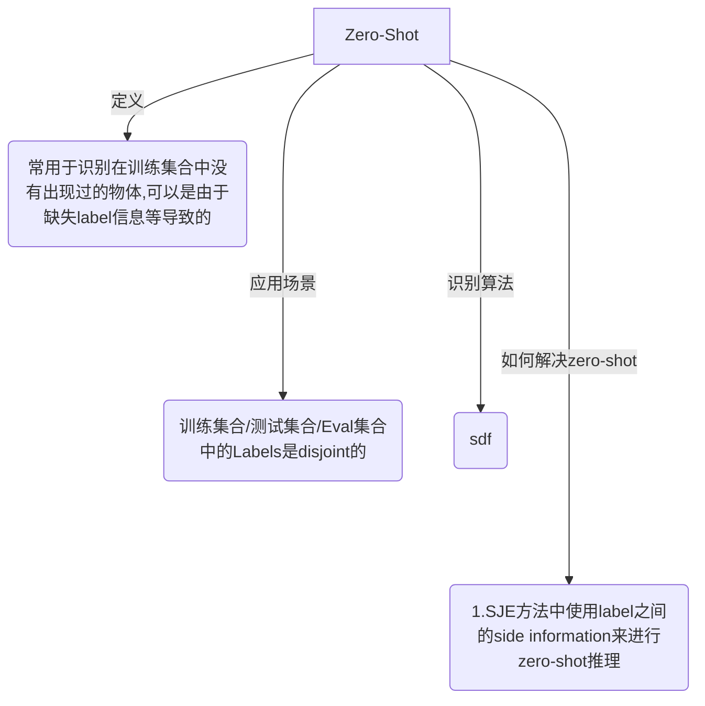
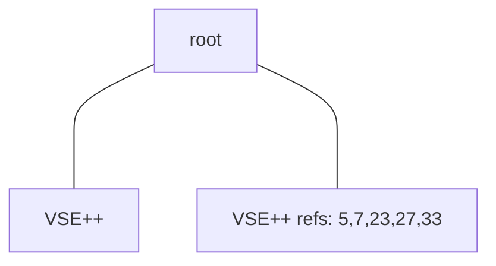

#### 深度学习

[介绍CNN的可视化发展过程](https://zhuanlan.zhihu.com/p/24833574)：知乎的介绍CNN卷积核可视化的文章，也许对其他的可视化过程也可以有启发。

#### RE

论文： Inter- pretable and globally optimal prediction for textual ground- ing using image concepts.

[visual-semantic ](https://github.com/topics/visual-semantic)

## Multi-Task Learning Basis

## Tasks and Methods Related to Referring Expression

##### CVPR2020:12-in-1

1. 最主要的创新是啥：引入了Multi-Task Learning。共享Emb的方式来建立Task的连接。

2. 基于的模型和论文： ViLBERT  [论文地址](https://arxiv.org/abs/1908.02265) CVPR2019

   总而言之，ViLBERT是一个文本和视觉的联合自监督预训练网络。使用2个并行TRM进行Inner-Modality特征提取。同时还有Co-TRM进行Inter-Modality提取。输入为IMG R0 R1 .. Rn CLS w0 w1 ... wm SEP。其中IMG和CLS作为视觉和文本两个Emb。2个自监督任务(proxy tasks)：Multi-Modal alignment prediction / Masked Multi-Modal Modelling。 

3. 贡献点：

   1. 提出了Multi-Tasks训练框架/方法，可以防止数据泄漏(因为图片互相引用)：直接删除所有任务中出现在其他测试集合中的Image。然后约11%reduction average cross datasets
   2. 在12个数据集，4个任务上进行了训练。270M -> 12M 模型参数
   3. 首先12-in-1训练，然后进行fine-tune可以达到平均涨点2%

4. 解决多任务训练问题：任务大小和难度都不同

   1. 使用三个技巧解决：Pretrain + DSG + Round-Robin Batch Sampling
   2. 海量超参数问题：single task pretrain 然后选择最合适的，然后组合就行。
   3. 线性 Warmup 很有用
   4. LossScaling：公共模型参数学习率设置为最小的学习率，然后Loss进行Scale来适应对应的学习率。

5. 如何处理Visual + Textual关系：(Grounding)
   $$
   Score = W_r * h_{vi}
   $$

##### [SCAN](https://arxiv.org/pdf/1803.08024.pdf)

label:scan

[代码](https://github.com/kuanghuei/SCAN)

[代码基于VSE++](https://github.com/fartashf/vsepp)

1. SCAN的简写是： Stacked Cross Attention Network
2. SCAN框架是隐空间模型。
3. SCAN视觉模型：Bottom-up attention network。语言模型GRU。
4. SCAN的Grounding框架：首先计算word-region scores，然后通过第一步的计算Image-Sentence scores。
5. Image-Text Stacked Cross Attention：
   1. ith region：计算出 vi 和 ai，其中ai是image-region对words的加权和。
   2. 通过cos(ai, vi)表示Region-Sentence Sim
6. Text-Image Stacked Cross Attention：和5类似，只是方向相反。
7. 相关论文：

##### [More Grounded Image Captioning by Distilling Image-Text Matching Model]()

label:pos-scan

1. 论文地址：可以在mendeley中看到原文。

2. POS-SCAN基于的方法是SCAN，将SCAN的Grounding方法引入了caption中：首先在数据集上训练一个改进的POS-SCAN模型，然后使用知识蒸馏的方式将POS-SCAN模型引入到Caption的Attention模块中，使用KL散度对Captioner添加一个蒸馏Loss。
   $$
   l_1(\theta) = \sum_{t=1}^{n}\{-\log(p_\theta(y_t^*|y_{1:t-1}^*)) + \lambda_1 \mathbb{I}_{y_t^*=y^{none}} KL(\beta_t||\alpha_t) \}
   $$
   其中的\alpha是POS-SCAN预测的attention，而\beta是Captioner的Attention LSTM变换得到的Attention。

3. 整个方法融入Grounding信息的方法分为两个阶段，首先是知识蒸馏将POS-SCAN的Attention知识给出来。其次是使用SCST-强化学习的方法来进行fine-tune 参数。

4. 实验结果 / SOA： 

   | 数据集                 | B@4  | CIDEr |
   | ---------------------- | ---- | ----- |
   | Flick30k-entities-test | 30.1 | 69.3  |
   | MSCOCO-test            | 38.0 | 126.1 |

   

##### [Nerual Baby Talk](https://openaccess.thecvf.com/content_cvpr_2018/CameraReady/0205.pdf")

label:nerual-baby-talk

CVPR2018：mendeley中存在

1. 基于2011年的Baby Talk模型。将其中的基于Templete+CRF模型改为了GenerateTemplete + Visual Word Based Region
2. 提出了两种词汇： visual word + textual word
3. 在CaptionFormular的基础上提出了GroundCaptionFormular
4. 在Sec 3.2 Caption Refine的Filling环节上：首先是预测单复数，然后预测refined-categories。例如dog -> puppy等。依赖的输入是region的视觉特征和ht。
5. 本方法的Grounding是Explicity Grounding[\ref{POS-SCAN}]。即我们对不同的region就是找到对应的Grounding的Words。
6. 未全看完

##### [Attention Correctness in Neural Image Captioning](https://www.google.com/url?sa=t&rct=j&q=&esrc=s&source=web&cd=&ved=2ahUKEwjbtrP85bfvAhVOQd4KHTaDDbQQFjABegQIAhAD&url=https%3A%2F%2Fojs.aaai.org%2Findex.php%2FAAAI%2Farticle%2Fview%2F11197%2F11056&usg=AOvVaw3o9xdu-s6V_BrpXMHjd53s)

label:AttentionMetric

1. 摘要表示：这个论文的工作是探索Caption模型中的Attention机制是否足够强大，是否足够有效？首先提出了一个Attention的Metric来表示Attention是否对应的比较好。其次，提出了一个模型，使用显示的强监督来对AttentionMap进行一个正则化（多任务Loss）。最后回答了，自己提出的AttentionMetric越好，那么相同的模型的Caption的BLEU4也越好。Flick30k test： 28.1
2. 未全看完

##### [Learning to Generate Grounded Visual Captions without Localization Supervision](https://arxiv.org/pdf/1906.00283.pdf)

label:CyclicalVisualCaption

1. ECCV 2020. FaceBook. 粗看
2. force the lstm pay more attention to decoded word other than the past word
3. [github code](https://github.com/chihyaoma/cyclical-visual-captioning.)
4. Based on GVD 方法：训练分为 decoding -> localization -> reconstruction
5. 动机：作者任务，Attention需要针对每个单词进行Attention，因为这样才有意义。但是当前使用的LSTM的HiddenVec是一个包含了过去序列信息的向量，不完全表示当前的decoded的单词。所以如果基于hiddenvec进行计算Attention，是无法得到word-region grounding的。因此作者提出了一个训练策略，强制使得Attention模型是按照Word来进行Ground的。并且全程不使用Annotation
6. 具体做法：作者首先decode，得到一个$y^d$的输出，然后对y^d进行Grounding，Grounding的过程基于每个单词。然后
7. ***发现问题：***误差累计效果。见Mendeley P7
8. ***描述问题：***（by [pos-scan](#pos-scan)）文章作者对这个方法进行批判，存在问题，首先是AttentionSupervision信号不足，其次是可能导致模型谈坍塌问题。（Model Collapse)

##### [When Does Label Smoothing Help?](https://arxiv.org/pdf/1906.02629.pdf)

label:LabelSmoothing

1. NIPS 2019. GoogleBrain团队. 粗看

##### [Self-critical sequence training for image captioning](https://openaccess.thecvf.com/content_cvpr_2017/papers/Rennie_Self-Critical_Sequence_Training_CVPR_2017_paper.pdf)

label:SCST

CVPR 2017

TOREAD

1. 针对序列生成问题，融入强化学习流行的SCST方法，将SCST方法引入了ImageCaptionGenerate的过程中，直接优化CIDEr/BLEU等指标。取得了SOA。MSCOCO Karpathy TEST： CIDEr 113

##### [Multi-task Collaborative Network for Joint Referring Expression Comprehension and Segmentation](https://openaccess.thecvf.com/content_CVPR_2020/html/Luo_Multi-Task_Collaborative_Network_for_Joint_Referring_Expression_Comprehension_and_Segmentation_CVPR_2020_paper.html)

label:MCN

CVPR 2020

TOREAD

1. 结果：

##### [Referring Expression Generation and Comprehension via Attributes](https://faculty.ucmerced.edu/mhyang/papers/iccv2017_referring_expression.pdf)

 label:Att / ICCV 2017 

1. 摘要：这个论文主要是引入了Attribute的使用。Attribute其实就是视觉-文本数据集中，文本中提取出来的具有语义的单词。通过这些Attribute构建一个预测Attribute的Loss。文中使用了多标签分类来进行预测。使用的 BCELoss。作者引入的任务是REC和REG两个任务，在两个任务都使用了Loss。而REG任务更是将图像的Attr vector用在了LSTM拓展里面

   

2. 为同类和不同类的物体使用了不同的Margin。

3. 为REG也使用了Max-Margin Loss。输入对为$(r_g, o_g)$，令$P(r|o)$为给定区域$o$，输出Expression为$r$的概率。则REG有两个Loss，一个为$l_1(\theta) = -\sum \log(P(r_g|o_g))$。另一个为概率Max-MarginLoss：$l_2(\theta)=-\sum max(0, \alpha - \log(P(r_g|o_k) +\log P(r_g|r_o)))$。其中$k$为负样本：同一图像中的其他样本。这样的目的是让正确的样本和错误的样本尽量可以被区分，区分距离为$\alpha$

##### [UNITER](https://arxiv.org/pdf/1909.11740.pdf)

label:UNITER

ECCV 2020

=> 本论文是类似ViLBERT的使用Transformer对Universe图像文本任务进行编码的任务。

1. 当前Referring Expression任务的结果表格：

   

   上图中，左边栏目是当前的SOTA，然后右边是UNITER的Base和Large两个预训练得到的结果。因为Refer-COCO使用的就是MattNet，所以超过MattNet是必然的。因此将之前的方法作为一个预训练模型，显然可以超越它。这个是提高精度的一个方法。当前最优的det应该在80以上才可以拿的出手。

2. 4个预训练任务： MLM / MRM / Image-Text Pair / Word-Region Pair 。 分别是，随机mask 15%的单词，然后预测单词。随机mask 一个region，然后重构（回归/分类等方法，参考Contrast Learning）。添加一个CLS，将CLS的输出作2分类预测。 Work-Region Pair使用 Optimal Transport 方法进行建模：

   【不是很明白】，输入是W和V，W是单词Emb的矩阵，V是Region的Emb矩阵。首先是TransportSpot是W和V的向量。然后定义两个weight vector a, b。这样可以定义出分布u, v是在W和V上的狄利克雷分布，然后a，b分别是概率函数。最后C(w_i, v_j) = spot 的cosine距离。这样计算了最优Loss之后可以得到T，然后使用T来反向更新W和V。直观理解，优化的同时会让传输更多的两个Spot的距离更加的近。

   【问题】：存在坍塌问题。其实这个作者引用的是 WGAN 的思想。

##### [Optimal Transport](https://arxiv.org/pdf/1803.00567.pdf)

总结文章： [ 知乎1 ](https://zhuanlan.zhihu.com/p/82424946)

## NLP - WordNet

#### 导图

展示各类的NLP embedding模型的方法。

## Knowledge Graph of Zero-Shot Learning(ZSL)

#### 导图

#### 参考文献：

1. [Zero-Shot Learning Survey 2017年](https://arxiv.org/pdf/1707.00600.pdf)

## Hard Negative Mining

## 论文阅读模版

变主动为被动，由被动传授转化为主动获取型方法，先定义主要问题，然后搜索答案，其次搜集启发，最后拾遗。

对于阅读论文来说，我们定义主要问题的一些模版：

1. 这个论文的---年限/会议/单位是什么？
2. 这个论文使用的数据是什么？
3. 这个论文的任务是什么？
4. 这个任务当前的难点是什么，和自己的任务有什么相关性。
5. 这个论文的最大创新点是哪些？
6. 每个创新点分别是在模型的那些步骤得到解决的？
7. 这个模型的训练流程？

## CVPR 2017

1. 这个论文的---年限/会议/单位是什么？
2. 这个论文使用的数据是什么？
3. 这个论文的任务是什么？
4. 这个任务当前的难点是什么，和自己的任务有什么相关性。
5. 这个论文的最大创新点是哪些？
6. 每个创新点分别是在模型的那些步骤得到解决的？
7. 这个模型的训练流程？

---

1. 当前的方法使用 Attribute？这些 Attribute 怎么使用的，哪些文章用的？

2. Attribute的缺点是什么？

   一个是：Attribute如果想要进行fine-grainned 分类需要更多的标签

   二个是：Attribute如果难以提供NLP接口？

3. 这个文章使用什么解决了这个缺点？

4. 这个文章基于的文章是：

   [Evaluation of Output Embeddings for Fine-Grained Image Classi- fication. In CVPR, 2015.]()   --- SJE

5. 主要贡献：

   1. 提出了两个数据集。提供了额外的caption数据：鸟+花
   2. 对4中的文章进行了拓展，可以端到端，可以用于zero-shot retrieval任务。
   3. 对比：字符Emb模型 + wordEmb模型 + 混合CNN-LSTM NLP Emb模型。第三个是自己提出的。

6. Extension of Structured joint embedding 模型是什么？这个模型缺点？这个模型针对什么任务？如何改进的？

   ESJE方法使用的是Attribute等提取的离散文本信息来作为retrievel，28.4%弱监督精度相比于 50%的Human Attribute强监督。

   

7. Zero-Shot 场景是啥？ 

   答： Zero-Shot场景就是，target classes 在 Train Val Test 3个集合上都是disjoint。然后Zero-Shot Learning可以通过挖掘classes之间的关系来判断zero-shot classes

8. [SJE](#SJE) 方法结果表示：1. 视觉特征中，GoogleNet比FV和AlexNet特征好。 2. Unsupervised特征中，text-based unspervised效果最好，wordnet其实效果一般。 3. human attribute中连续特征比离散特征好。 4. 多特征融合可以有cnc和cmb两种方式，其中各有千秋，可以作为调参方式。 5. 联合使用Word2Vec和fine-grained document来进行若监督训练output embedding（class embedding）

9. [SJE](#SJE) 实验过程有时间可以学习一下。构建一个 zero-shot learning的branch mark就好了。因为高水平CV会议一般需要多个数据集验证。更好的是多个任务验证方法的有效性。

##  How to get Idea

主要问题：如何寻找到新的IDEA。如何在一个模型的基础上找到模型的不足？

这个短文主要记录一些关于IDEA的寻找的例子和思考。是通过阅读论文，然后思考当前论文是如何在之前的方法上找到IDEA的过程的总结和记录。

##### 方法1： 

## IDEA / 观察现象

##### Relation Between Symmetry Attention

***研究问题***： Sets 2 Sets Attention有一个对称性的问题没有被考虑：以Region-Word Grounding案例来说，Region中有多个vi，Word有多个wi。那么vi和wj如果做target dot attention的话，那么v对W的Attention和w对V的Attention有什么关系呢？？？

***思考问题***：是否RE Generation和RE Comprehension可以组合成为一个复杂的类似GAN的网络？？？GAN具有对抗性，但是REG和REC不具有对抗性。“Teacher 和 Student 模型？”

​		有人做了！！！！可恶。[Comprehension-Guided Referring Expression ](https://arxiv.org/pdf/1701.03439.pdf)。先训练一个Comprehension模型，然后用Comprehension模型来指导Generation模型。

***思考一些可视化方法***：按照文本样本搜索 + 按照文本分类找到高响应。 MLP对x的高响应参数，反求x的局部最小值。

***走1Stage的道路对det来说更好***：2Stage的道路使用det的方式会出现问题：***出现很多非物体但是也是referred对象***。如果使用2Stage中与预训练好的，那么必定行不通。所以需要进行fine-tuning。如下图，左下角按理来说是不会被frcnn检测到的，因为他不是物体，所以这个问题无解。引入cross-correlation的方法模版查找？融合两者？

***添加深度信息***：[图像深度预测博客](https://heartbeat.fritz.ai/research-guide-for-depth-estimation-with-deep-learning-1a02a439b834?gi=e4085cae918d)

***MattNet Case Study***：这个错误很奇怪，理论上不应该有这个问题。 

***奇怪的观察：（位置信息来源？）***：在[region2word](#exp_1)的实验中，发现最后的模型效果对left/right等具有很好的区分作用。但是特征中没有使用到位置信息。这个信息是怎么学习来的呢？来源是视觉特征中的哪里？

​		$\bullet$  解答：来源应该是ResNet捕捉到的全局信息。因为ResNet101可以涵盖所有的图像，即每个像素都对当前7x7的点有影响。所以使用CNN本来就可以获取到上下文信息，因此判断出是否是left也就是可能的。【猜想验证：使用ResNet18的话，应该就无法有效的预测left和right，因为卷积不包含整个图像。】

***可视化方法：***如下图是思考的一些可视化的方法，包含3个方向：问题定义为给定score = f(x)还有很多的(x, score)样本，如何给出x和score最相关的特征？？

*** 引入Mutual Information的Loss*** ：因为对于Referring Expression来说，唯一性 / 排他性让MI信息可以被充分利用。见 MMI 方法中的引入。思考如何融入Mutual Info Loss到当前的雏形 Word2Region Referring Expression中。

***长尾名词***：比如Texi图。不幸的是，有工作了。zero-shot grounding。训练集合中只有5个texi的样例。测试集合中有10个左右的测试样例，所以这些样例当然就不会有很好的结果。

​		[Zero-Shot Grounding of Objects from Natural Language Queries](https://arxiv.org/pdf/1908.07129.pdf)

​		有效性验证：通过将低频率的名词从测试集合中删除，最后的到的结果如下：

| acc@1[>=5]  | acc@1[>=10]  | acc@1[>=15] | acc@1[>=20] | acc@1[all]   |
| :---------: | :----------: | :---------: | :---------: | ------------ |
| 0.872[8412] | 0.883 [7566] | 0.886[7048] | 0.888[6757] | 0.848[10000] |

​		趋势线可以看出，在低频部位(<=10)的哪些referring expression是误差的主要来源，因为下降的斜率最高，很多都没有被正确的分类。因此长尾是一个重要的问题。可以提高约4%左右的点。

***Multi Region Context Mining***： 【IMP】现存的方法中，很多方法都只使用region的图像特征和textual特征，但是其实针对对比的Region来提取特征比较好。就是如何利用context region特征来对当前region进行建模。 //  根据图片中的region pair对regions进行不同的特征提取？

***覆盖现象！***：man in black，因为man比较多，black比较少，所以man的权重会普遍高于black，因此man会起到决定性的作用，但是其实应该是black起到决定性的作用。man in black

1. 探索权重大小的本质：首先思考是不是因为词频的原因：

   | 单词  | 词频（#） | 权重 |
   | ----- | --------- | ---- |
   | man   | 5244      |      |
   | black | 1571      |      |
   | woman | 1860      |      |
   | right | 9293      |      |
   | in    | 10784     |      |
   | girl  | 1768      |      |

   首先肯定不完全是因为词频。因为in词频很高，但是权重很低。其次man对于真正的男人图片来说，权重很高0.65，但是对女人的图片来说很低0.15左右。所以应该是由视觉和文本的对应关系来的。但是其实同样的对于Left / Right之类的词，对于不同的object也是不一样的幅值大小。例如Bike的case中，right 只是占了0.08的分值。

2. 解决覆盖现象：更好的Attention函数： 尝试解决覆盖现象。使用lstm之后的信息来作为global textual information。可以将这个问题理解为，上述的word2region相似度是可信的（case分析看来，也是比较可行的，attribute的相对关系还是比较准的。）问题出在单词的影响程度！不同单词的att weight不应该由单词的相似度来决定，而是由全局信息来决定。key value共享的attention只会使得权重出现bias（理解为权重积累现象）。如果出现了一个更好的挖掘word weight的权重函数，那么可以解决上述问题。使得更关键的单词权重更高即可。

   发现问题：为什么使用LSTM隐藏层作为Att的计算向量，所有的单词都是差不多的大小。其实他们的数值其实都还行，一个是-0.09，一个是0.22。因该是因为cosine similarity的原因导致了，Softmax的输出应该是[-inf, inf]。而不是[-1, 1]。因此会导致欠拟合，因为cosine相似度随着变近会梯度越来越小，因此会很难上升，而dot是线性的。不会有衰减。其实BPR-LOSS和Cosine都是类似，核心思想就是带衰减的Loss。

3. 解决覆盖现象：Pair-Wise权重函数 ：普通的基于文本的Attention只会选择哪个单词更加靠谱。但是其实对于两个属性来说，只有在给定两个照片之后才会更加清晰哪个更加重要。比如“黑色的狗”，那么当给定两个狗的时候，“黑色”更加重要。给定人和狗的时候，这个时候“狗”就更加重要。因此可以基于PairWise的Regions来寻找权重函数。

   方法一：通过建模$P(R_1>R_2|S)$来进行inference。虽然会引入复杂度，但是可以更加直观。解决上述的Region-Pair Attention问题。因为单纯的基于Region和文本进行Attention其实不准确。而基于不同Region来进行的其实更加的直观和有效。

1. 解决覆盖现象：逐个推理方法 ：这个不再使用加权的方法，而是逐个进行推理。将$P(R|S)$建模为了$P(R|A1,A2,A3)$。然后进行条件概率展开！推导公式，提供Loss。

   **实验中！！**

***思考：为什么加入了LSTM可以效果好这么多。但是其实并不合理？？*** 观察发现，在word2region的过程中，使用LSTM输出的hidden作为word的隐藏向量，可以起到更好的精度。但是其实可视化之后，单词的对应关系并不合理，所有的权重都集中在了 <SOS>的dummy word上面。这个原因是啥，如何使用单词的WordEmb向量得到很好的精度而且很好的对应关系。

***Error Case***： 【Word2Region的case】

1. COCO_train2014_000000566612.jpg :  两个黑色衣服和白色衣服无法区分。同样是人区分不了。
2. COCO_train2014_000000534292.jpg：帽子遮挡脸的妇女，对woman的响应居然比男孩小。
3. COCO_train2014_000000495987.jpg：两个女人，一左一右。发现不同的单词具有不同的相似性。例如right和left因为词频高，因此会更加视觉相关，所以向量也会比较大。（但是cosine不应该会发生这个情况？？？）
4. COCO_train2014_000000574299.jpg：两个骑摩托的警察，left bike和right bike。发现的问题是，right和left对结果起到的权重很小，但是bike起到的权重很大！

##### 进行 Region-Word 的建模（独立为章节）

1. OP。
2. 整数规划 / 分数规划 / 优化问题
3. Attention的方法。
4. MIL学习方法。

## TODO

1. OP 和 Uniter 的 OP 理解
2. 新的MattNet改进论文研究，为什么？怎么改进的？怎么想到的？
3. 代码，实现Transformer库，融入到 Cvpack2 里面去。
4. Layer Norm为啥有效？流形解释？

## Referring Expression Experiment

1. word2region / region2word 对应关系  #2021-04-16的文档 

   1. 调参数；精度记录（Referring Expression ｜ gt）

      | acc@1 / GT | acc@1 / DET |
      | :--------: | :---------: |
      |   0.769    |    None     |

   2. 添加 word2region attn的可视化表达 ( Doing )

   3. ***BEST*** : DONE : 使用LSTM来解决emb的多义性问题，即使用lstm hidden word emb 和 region + spatial 来进行预测，可以得到什么样的精度：

      $\bullet$  实验结果：（效果很棒，就差一点超过MattNet了！！）

      | acc@1 / GT | acc@1 / DET |
      | :--------: | :---------: |
      |   0.848    |    0.753    |

   4. Attribute Predict 是否有效？

2. Hard Negative Sampling: (效果不错，应该是在多个迭代下，还是具有一定的抗噪能力。而且可以避免坏的局部最优解。见论文VSE++)

   | acc@1 / GT | acc@1 / DET |
   | :--------: | :---------: |
   |   0.779    |    None     |

3. MMI： （类似GroundR之类的Generate Loss效果是不是更好？）。[论文 MMI方法](http://de.arxiv.org/pdf/1511.02283)

   

4. visdiff 特征的引入。[论文:visdiff](https://arxiv.org/pdf/1608.00272.pdf)

5. No Spatial Feature的left right语义识别实验：

   1. 开始认为是由于padding导致的。做了扰动实验，通过将上边界的一半填充为0，但是发现结果还是可以分辨top。但是不是那么的靠近边界而已。说明padding有一部分影响，但是还有其他的特征使得图像可以分辨top / right。总体而言padding解释的话，其实不是很充分，我更加倾向于CNN具有挖掘global和local特征对比的能力，因为卷积操作使得region可以看到远处的信息。可以看到224x224图像的全图信息：总体的缩放度，肯定是可以看到global context的。因为ResNet101中conv3曾 3x3的卷积卷了23个，2*23>28涵盖了所有的输入。所以ResNet获取的特征每个7x7像素点包括了所有的global context信息。

      

   2. 应该是卷积的过程本来就包含了global信息。所以卷积操作其实可以包含很多信息。可以用来做上下文特征预测。如何改进呢？？？显示的加入spatial 信息？

      | acc@1 / GT | acc@1 / DET |
      | :--------: | :---------: |
      |   0.779    |    None     |

      可见，显示的加入Spatial信息其实对结果的影响不大。这个也和ResNet其实可以很好的捕获上下文信息如出一辙。

6. $P(S|R)$ 转化为 $P(S|R_1, R_2)$的Region Pair。NegBag 方法。

7. 词频和权重的关系：结论word和region相似度相对关系还是比较靠谱的。错误的是phrase之间word的重要程度函数。
